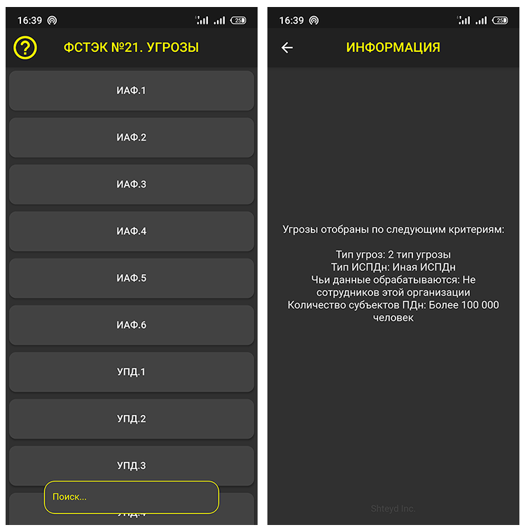

# Fstec21 App

 
 

    
Fstec21 project written on Flutter.

    
This app was created as part of project activities at the university

 
 
<h2>How to build</h2>

Clone the project through `git clone https://github.com/Shteyd/fstec21_app` and run `flutter build ...` or `flutter run`

<h2>Official sources</h2>

<ul>
    <li><a href="https://fstec21.blogspot.com/">Официальный сайт Фстэк 21</a></li>
    <li><a href="https://fstec.ru/component/attachments/download/636">Методический документ</a></li>
</ul>